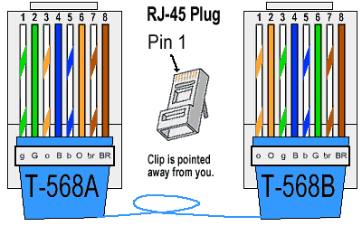

## Atividade
Conforme atividade abaixo crie um arquivo mostrando um passo a passo com as telas de cada ação das questões 1 e 2. Faça em arquivo PDF ou Editável. 

Segue a atividade:
1. Mostre os passos para realizar compartilhamento de uma pasta ou arquivo ou diretório numa rede ponto a ponto.
2. Mostre o modelo de cabeamento (mostrar as cores para cada ponta) para conectar uma rede ponto a ponto.

OBS: (Crie o passo a passo)

## Resposta

### Questão 1:
- ### Material Necessário
1. Cabo UTP ou STP (fig.1)
2. 2 Conectores RJ45 (fig.2)
3. Alicate Crimpador (fig.3)

Fig.1

Fig.2

Fig.3

- ### Montando a parte física
1. Descasque o cabo, e deixe aproximadamente 2,5cm de fio desencapado, e você verá 4 cabos, cada cabo composto por 2 fios trançados (fig.4)
2.  Organize os fios usando um dos padrões da figura 5 (fig.5)
3. Conecte o conector RJ e use o alicate para unir o conector aos fios/cabos

Fig.4

Fig.5
- ### Passo a passo

1. Pegue cada ponta de cabo e conecte à rede
2. Em seguida configure o sistema operacional (vamos considerar que esteja utilizando Windows) para permitir o compartilhamento de arquivos e/ou pastas pela rede
3. Dê um duplo clique no ícone Rede do Painel de Controle
4. Selecione a guia Identificação
5. Nome do computador: coloque aqui um nome para o micro que está sendo configurado (Será através desse nome que ele será conhecido na rede)
6. Grupo de trabalho: o nome de sua rede (Você deverá por o mesmo nome em todos os campudadores)
7. Descrição do computador: Coloque uma breve descrição do micro que está sendo configurado
8. A máquina está pronta pra compartilhar e receber arquivos pela rede
9. Agora, compartilhar um arquivo, primeiro abrimos o explorador de arquivo
10. Em seguida escolhemos a pasta ou arquivo que queremos compartilhar
11. Clicamos com o botão direito do mouse em cima do arquivo ou pasta
12. Selecionamos a opção "conceder acesso à"
13. Logo, escolhemos as máquinas que desejamos compartilhar os arquivos ou pastas
14. Completo, agora os arquivos ou pastas escolhidas estão disponíveis para todas as máquinas que você selecionou.

### Questão 2

