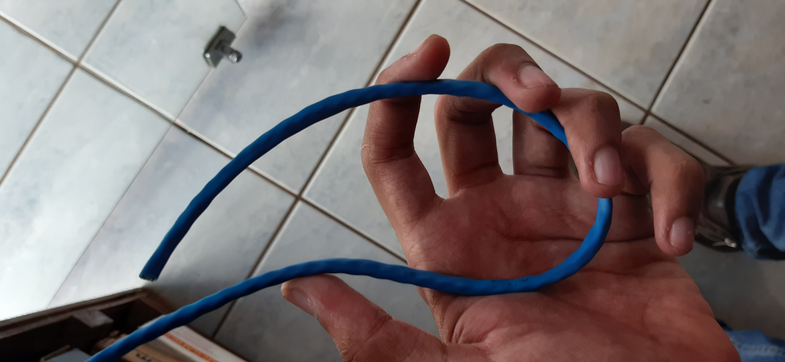
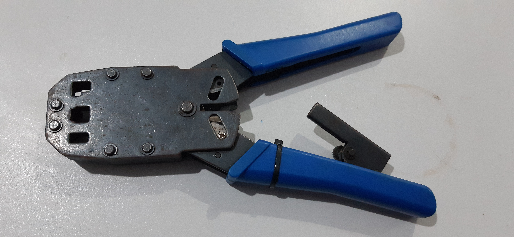

## Atividade
Conforme atividade abaixo crie um arquivo mostrando um passo a passo com as telas de cada ação das questões 1 e 2. Faça em arquivo PDF ou Editável. 

Segue a atividade:
1. Mostre os passos para realizar compartilhamento de uma pasta ou arquivo ou diretório numa rede ponto a ponto.
2. Mostre o modelo de cabeamento (mostrar as cores para cada ponta) para conectar uma rede ponto a ponto.

OBS: (Crie o passo a passo)

## Resposta

### Questão 1:
- ##### Material Necessário
1. Cabo UTP ou STP (fig.1)
2. 2 Conectores RJ45 (fig.2)
3. Alicate Crimpador (fig.3)
5. Lâmina para desencapar o fio

Fig.1

Fig.2

Fig.3

- ##### Montando a parte física
1. Descasque o cabo, e deixe aproximadamente 2,5cm de fio desencapado, e você verá 4 cabos, cada cabo composto por 2 fios trançados (fig.4)
2.  Organize os fios usando um dos padrões da figura 5 (fig.5)
Fig.4

Fig.5

- ##### Passo a passo
1. 
2. 
3. 
4. Para compartilhar um arquivo, primeiro abrimos o explorador de arquivo
2. Em seguida escolhemos a pasta ou arquivo que queremos compartilhar
3. Clicamos com o botão direito do mouse em cima do arquivo ou pasta
4. Selecionamos a opção "conceder acesso à"
5. Logo, escolhemos as máquinas que desejamos compartilhar os arquivos ou pastas
6. Completo, agora os arquivos ou pastas escolhidas estão disponíveis para todas as máquinas que você selecionou.

### Questão 2

