## Atividade
Conforme atividade abaixo crie um arquivo mostrando um passo a passo com as telas de cada ação das questões 1 e 2. Faça em arquivo PDF ou Editável. 

Segue a atividade:
1. Mostre os passos para realizar compartilhamento de uma pasta ou arquivo ou diretório numa rede ponto a ponto.
2. Mostre o modelo de cabeamento (mostrar as cores para cada ponta) para conectar uma rede ponto a ponto.

OBS: (Crie o passo a passo)

## Resolução

### Questão 1
- ### Passo a passo
> Nota: vamos utilizar o termo **_documento_** para nos referirmos tanto à arquivos quanto pastas

Vamos considerar que estamos no Windows tentando conectar um 
computador à rede para compartilhar documentos

- ### Configurando o SO
1. Clique com o botão direito em Meu Computador (fig.1)
2. Em seguida, selelecione Propriedades (fig.2)
3. Irá aparecer esta tela (fig.3), e então clique em Configurações Avançadas do Sistema
4. Logo abaixo desta opção (fig.4)
5. Irá aparecer esta janela (fig.5), clique na aba Nome Do Computador (fig.6)
6. Clique em Alterar e edite (fig.7), abrirá uma nova janela (fig.8) e será este nome pelo qual seu computador será reconhecido na rede
7. O grupo de trabalho é o nome da rede em que os computadores estarão conectados
8. Coloque o mesmo nome da rede para todos os computadores
9. A rede já está configurada

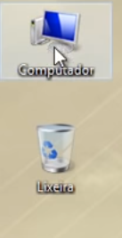
(Fig.1)

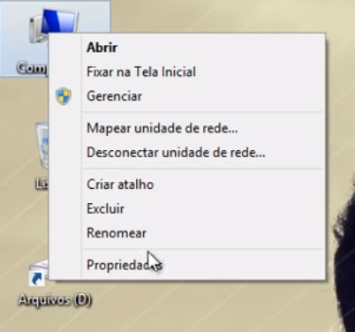
(Fig.2)

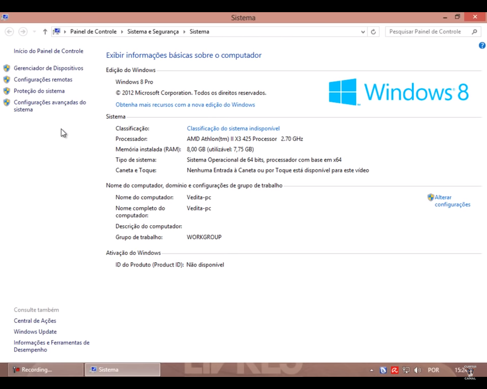
(Fig.3)

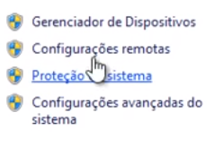
(Fig.4)

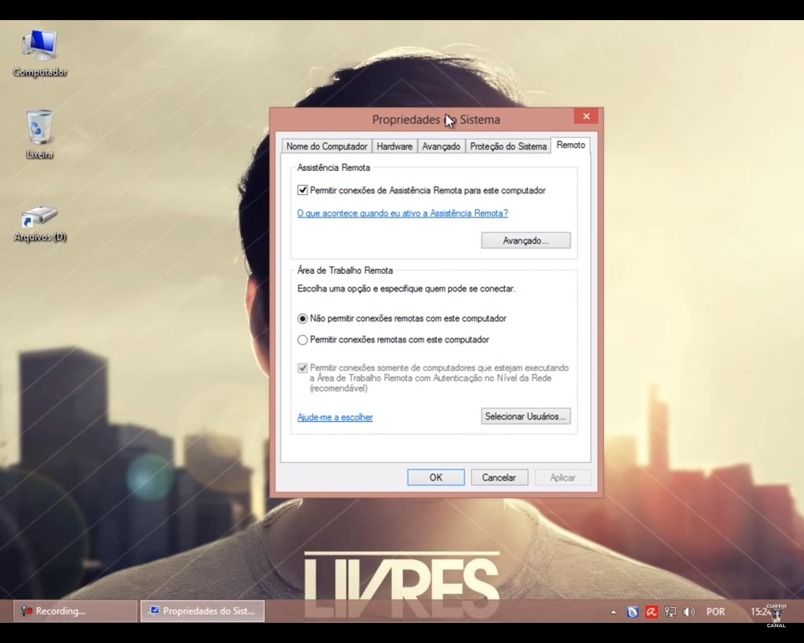
(Fig.5)

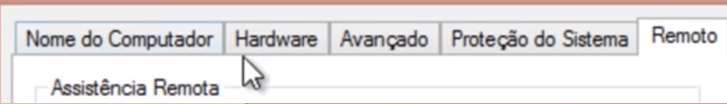
(Fig.6)

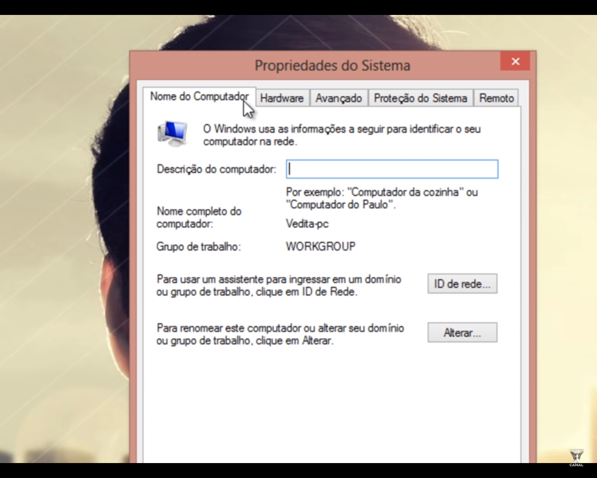
(Fig.7)

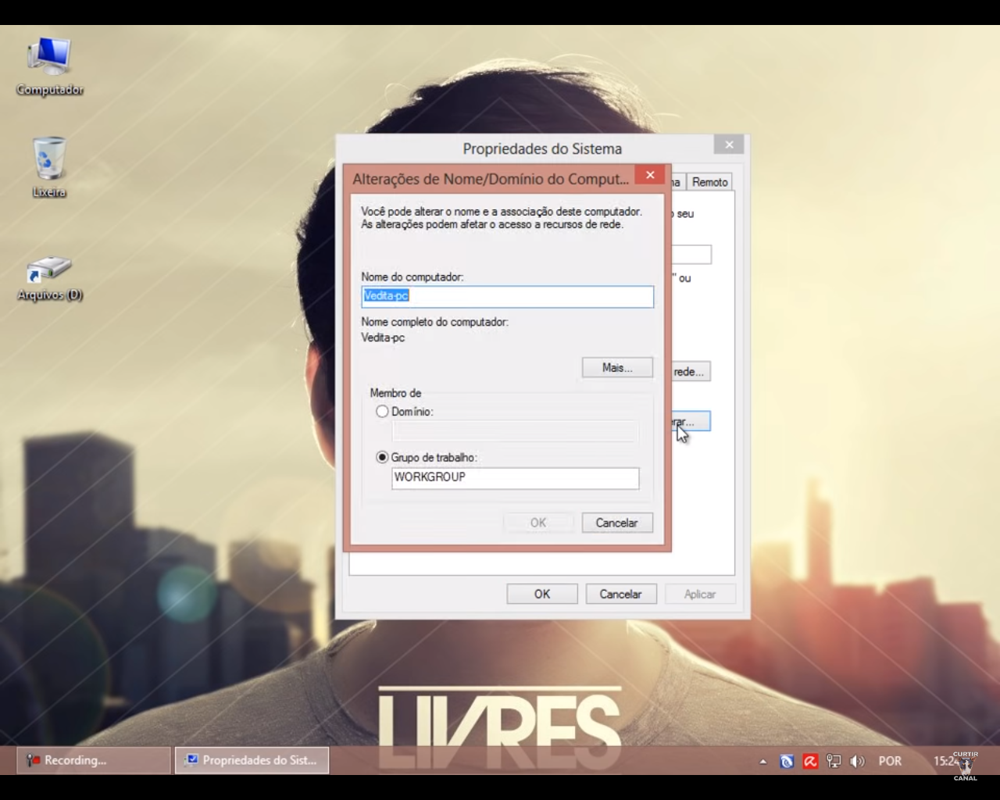
(Fig.8)

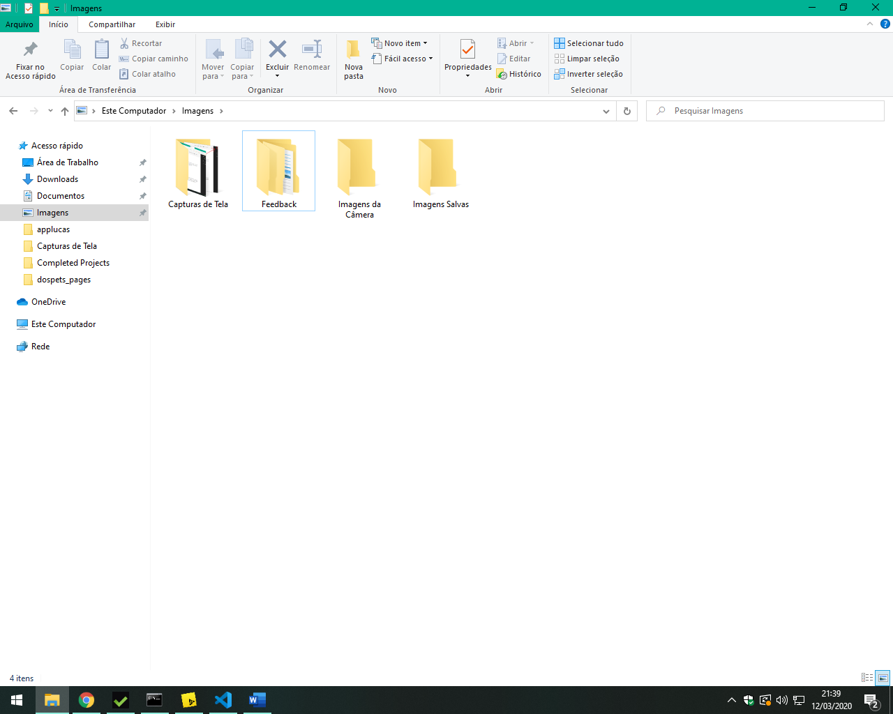
(Fig.9)

- ### Compartilhando Arquivos
10. Agora que a rede já está configurada e os computadores conectados, para compartilhar um documento, primeiro abrimos o explorador de arquivos (fig.9)
11. Em seguida escolhemos a pasta ou arquivo que queremos compartilhar (fig.10)
12. Clicamos com o botão direito do mouse em cima do arquivo ou pasta (fig.11)
13. Selecionamos a opção "conceder acesso à" (fig.12)
14. Logo, escolhemos as máquinas que desejamos compartilhar os arquivos ou pastas (fig.13)
15. Completo, agora os arquivos ou pastas escolhidas estão disponíveis para todas as máquinas que você selecionou (que foram configuradas anteriormente)

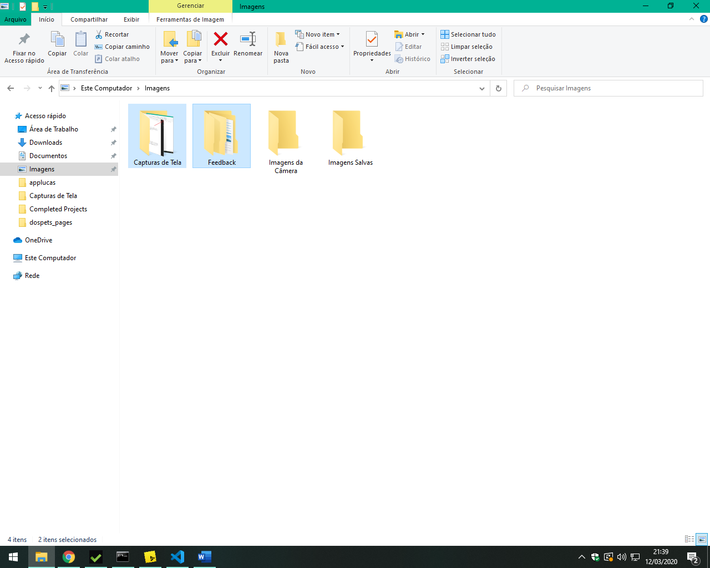
(Fig.10)

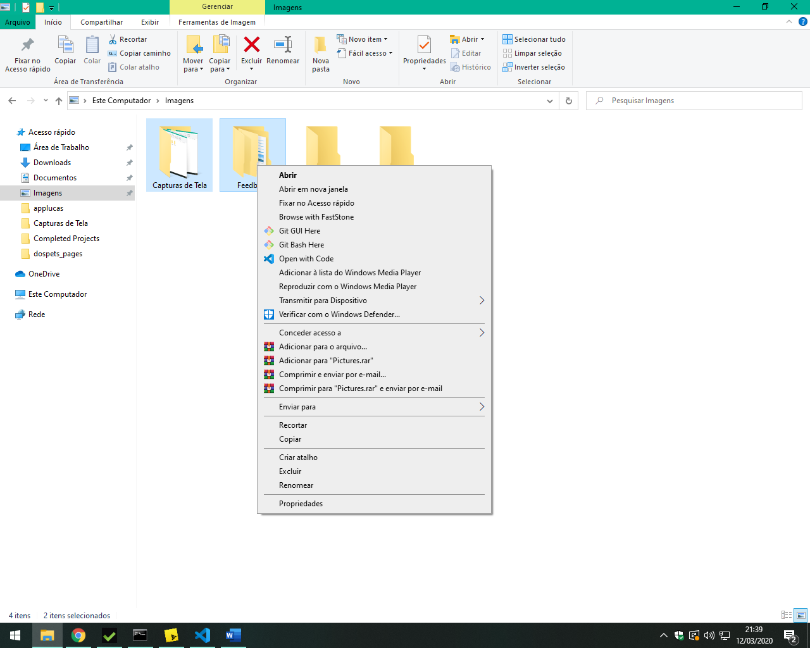
(Fig.11)

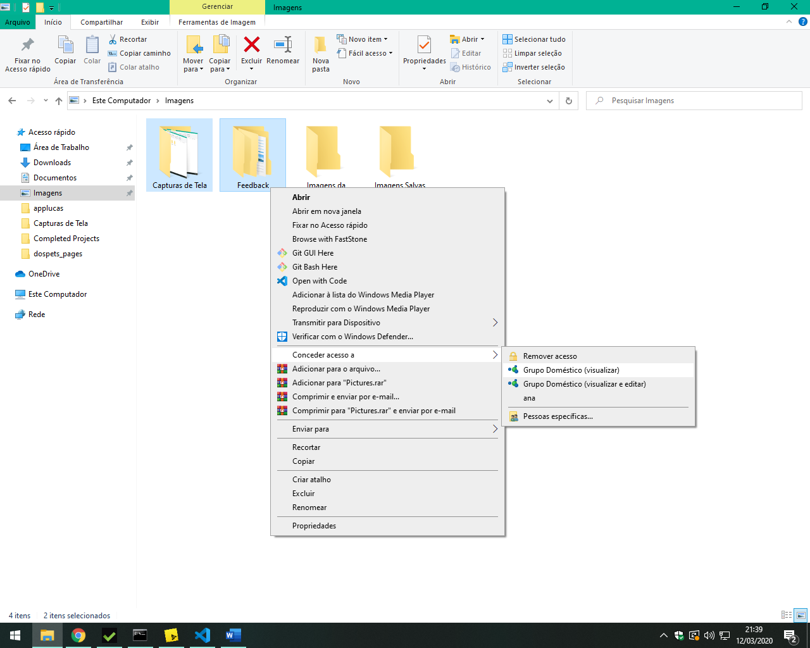
(Fig.12)

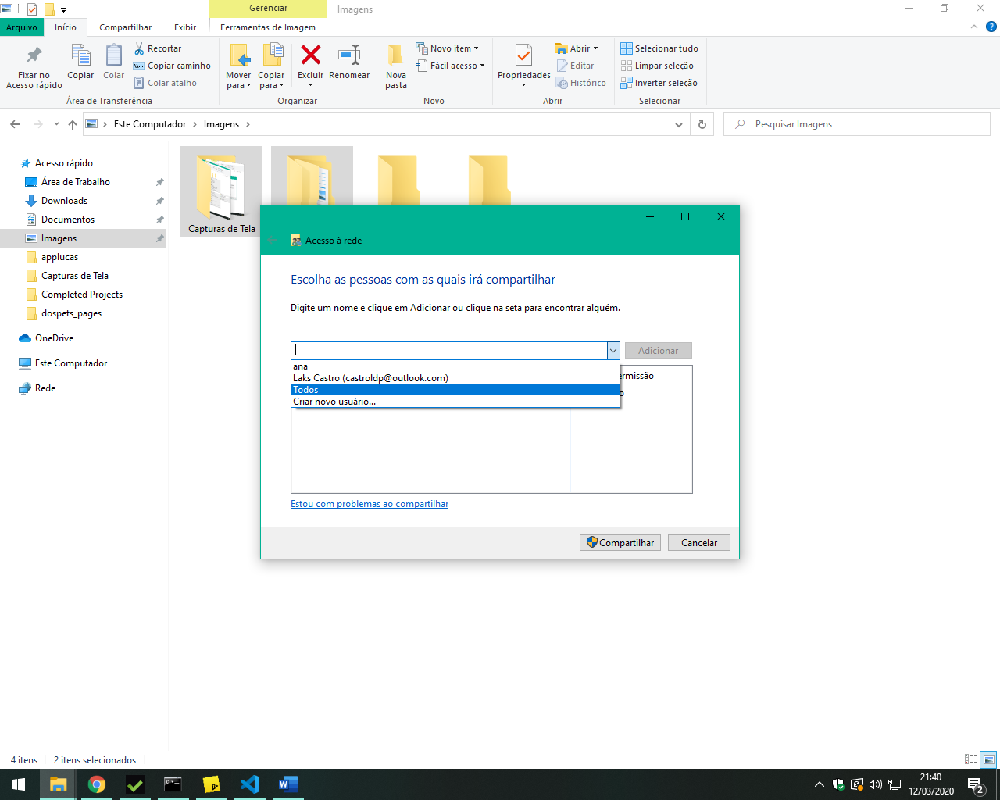
(Fig.13)

### Questão 2
- ### Material Necessário
1. Cabo UTP ou STP (fig.1)
2. 2 Conectores RJ45 (fig.2)
3. Alicate Crimpador (fig.3)

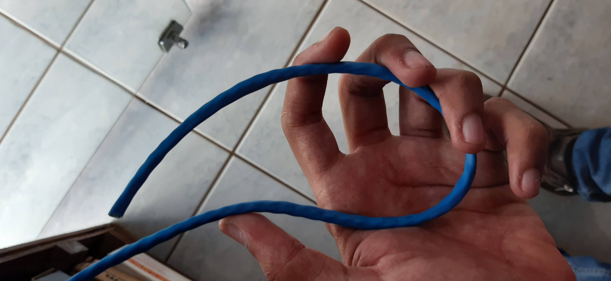
(Fig.1)

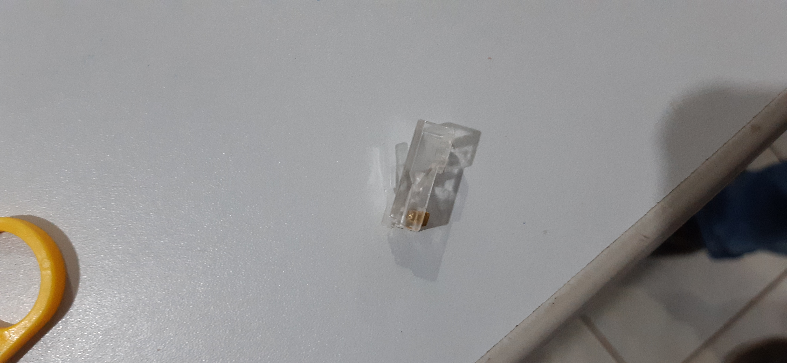
(Fig.2)

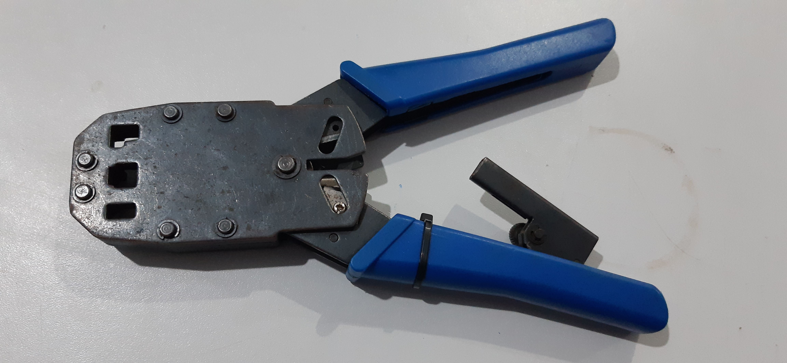
(Fig.3)

- ### Passo a passo
1. Descasque o cabo, e deixe aproximadamente 2,5cm de fio desencapado, e você verá 4 cabos, cada cabo composto por 2 fios trançados (fig.4)
2. Organize os fios usando um dos padrões da figura 5 (fig.5)
3. "Organize": se refere a dividir cada fio
4. Coloque-os em ordem usando o padrão A (Depois, para a outra ponta, faça este mesmo processo usando o padrão B, a ideia é estar com o cabo com uma ponta no padrão A e outra ponta no padrão B). Os padrões estão na figura 5 (na hora de montar, lembre-se de segurar no ponto de onde você descascou para o fio não desarrumar novamente)
5. Use a unha para deixá-los na ordem correta e retos
6. Use um pequeno alicate e corte-os a deixar aproximadamente 30cm de cabo desencapado para fora
7. Em seguida encaixe estes no conector RJ45
8. Use o alicate para unir o conector aos fios/cabos
9. Repita o processo para a outra ponta (Lembre-se de usar o outro padrão, o que não foi usado desta vez)

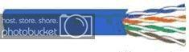
(Fig.4)

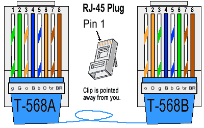
(Fig.5)

### Referências
- https://www.youtube.com/watch?v=bLeHmcPdNsc
- https://www.clubedohardware.com.br/forums/topic/276798-tutorial-montando-e-configurando-uma-rede-ponto-%C3%A0-ponto/
